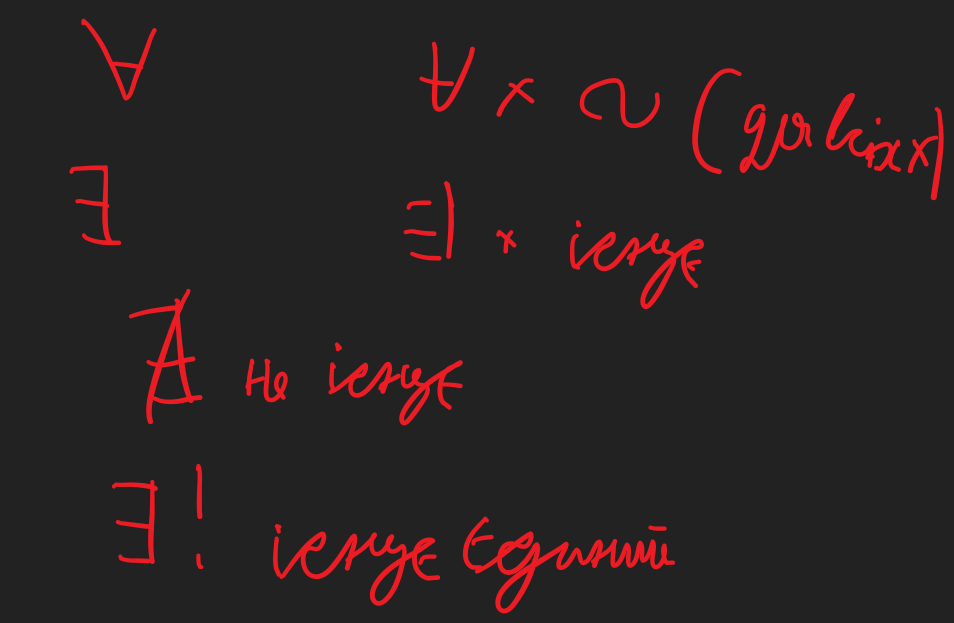

# Спеціальні розділи математики-1. ДИскретна математика
- План роботи в семестрі
  - Лекції 36 год - 1 раз на тиждень
  - Комп'ютерні практикуми 36 год
  - Модульна контрольна робота(2 академ год)
  - Екзамен
- Література
  - Андресон Джейсм. Дискретна математика та комбінаторика. вильямс 2003
  - Бондаренко. Комп'ютерна дискретна математика. сміт 2004
  - Бардачов. Дискретна математика відручеик. вища шк 2002
  - Капітонов. Основи дискретної математики. 
  - Молчановський Конспект лекцій 
  - методичні вказівки до сам роб з комп'ютерна дискретна математика
  - таран дисктерна математика
  - тішин дисктерна математика в примерах и задачах
 
---

# Вступ
- Мета 
  - Вивчення дисципліни набуття ключових фахових компетентностей, теоретичних знань і практичних навичок з дискретної математики
- Предметом вивчення дисципліни є основні поняття і твердження з різних розділів дискретної математики
- Завдання вивчення дисципліни
  - оволодіння основними роняттями теорії множин, теорії відношень, теорії графів, математичної голіки та комбінаторики, набуття практичних навичок, використання понять теорії множин, теорії віджношень, теорії графів, математиіної логіки такомбінаторики для розв'язування задач

- структура курсу
  - Теорія множин
    - в цьому розділі розглядається фундаментальне поняття множини. Наводяться операції над множинами, різні типи множин.
  - Алгебри
    - розглянуті уявлення про алгебраїчний підхід і поняття алгебраїчної системи
  - Математична логіка
    - Логіка - є могнутнім засобом для вирішення задач людиною. Математична логіка - спроба формально описати ці спроби\
    - Двійкова логіка
  - Логічні числення
    - Продовження попереднього 
  - Комбінаторика
    - підгрунтя до багатьох важливиз напрямків комп'ютерних наук
      - важкорозв'язувані задача
      - оцінка складності задач та алгоритмів
    - продовження - теорія імовірностей та мат статистика
  - Теорія графів
    - опис програмних на багатьох інших моделей
    - представити задачу та вирішити за допомогою теорії графім 
    - розглядаються графи, властавості та дії над ними
  -  Теорія граматик
     -  створення штучних мов
     -  поняття граматики класифікіція за Хомським
     -  граматики та їх властивост
     -  алгоритми
  - теорія автоматів
    - автомат - апарат направлений на моделювання й проектування його.
    - поняття скінченого автомату
    - машини Тьюрінга й проанізовані їх властивості
    - поняття аналізу й синтузу автоматів і експерименти по розпізнанню стані
    - Показано зв'язок автоматів із граматиками, коли для кожної мови можна постамити граматику що породжує її, й автомат що її розпізнає
# Теорія множин. Множини операції над множинами. Інтуїтивне означення множини
- Множина
  - > Сукупність об'єктів зі схожими рисами
    - множина дійсних чисел
    - множина чисел кратних п'яти
  - Множини позначають великими літерами
    - A, B ,C D,... X, S
  - Елементи множин познаються маленькими літерами
    - a, b, c
  - a є A
  - b !є A
  - Якщо S = {a, b, c}, кількість елементів = |S| = 3
    - Порядок елементів у множині не має значенн
- Різні способи задання множини
  - Словесний
    - Використовує опис характеристики елементів
      - S - множина парних чисел
  - Спосіб задання списком або переліком всіх елементів у {}
    - S = {1, 2, 3}
    - Мы не можемо описати всі множини цим способом(не можемо нескінченні множини)
  - Пердикаткий або характеристичний (найзагальніший)
    - за допомогою їарактеристичного предикату дозволяє описати належність
      - {x : P(x)}
      - S = {x : x Є N, x - кратне 5}
- Порожня множина
  - !O
    - S = {x : x - непарне число, що ділиться на 2}
  - A = {1, 2}, B = {1, 2, 3}
    - A c B 
- Поняття універсуму або універсальної множини
  - Позначається U
  - Множина з такою властивістю, що всі множини які розглядаються належать цій множині.
  - 
- Три леми
  - А c B & B c A <--> A=B
  - Властивість тринзитивності
    - A c B & B c C <--> A c C
- Булеан
  - Множину елементами якої є всі можливі підмножини а називають множиною підмножин(булеаном) множини А і позначають P{A}
  - Так для триелементної множини А = {a, b, c} маємо P(A) = {!O, {a}, {b}, {c}, {a, b}, {a,c}, {b,c}, {a,b,c}}
  - S = {1, 2}
  - P(S) = {!O, {1}, {2}, {1,2}}
    - |P(A)| = 4 = 2^2
- Операції над множинами
  - Об'єднання A і B (A u B)
    - множина, що склажається з усіх елементів множин А, всіх елементів множини В і не містить ніяких інших елементів
    - Приклад
      - {1,2,3} u {2,3,4} = {1,2,3,4}
  - Переріз(перетин) А і В (А п В)
    -  множина, що складається з тих і тільни тих елементів, які належать одночасно множині А та множині В
    -  приклад 
       -  А п B = {x : x є А & x є В}
 - Різниця А і В або відносне доповнення
   - Це множина що складається з тих і тільки тих елементів які належать множині А та не належать множині В 
   - приклад 
     - А/В = {x : x є A & x !є B}
 - Симетрічна різниця Диз'юктивна сума А і В A8B
   - Множина що складається х усіх елементів А, які не належать множині В та навпаки
     - приклад 
       - {x : {x є A & x !є B}||{x є В & x !є А}}
 -  Абсолютне доповнення A`
    -  Мноєина що містить усі елементи універсуму крім А
       -  приклад
          -  {x : { x !є A}}
