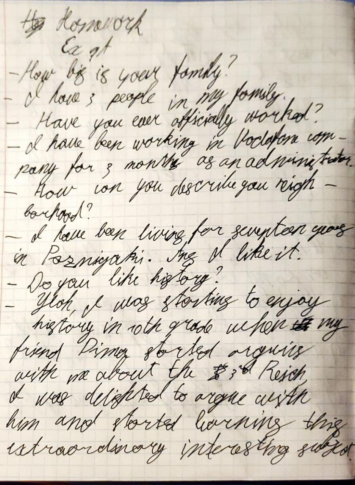
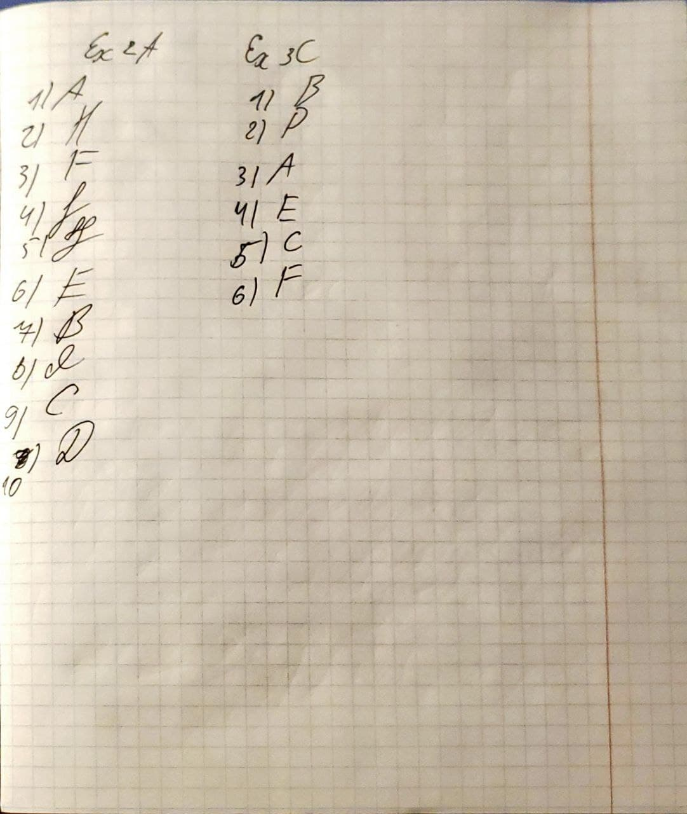

# Homework
- Exercise 1A
  - How big is your family?
  - I have 3 people in my family.
  - Have you ever officially worked?
  - I have been working in Vodafone company for 3 months as an administrator.
  - How can you describe your neighborhood?
  - I have been living for seventeen years in Pozniyaki. And I like it.
  - Do you like history?
  - Yeah, I was starting to enjoy history in 10th grade when my friend Dima started arguing with me about the 3rd Reich, I was delighted to argue with him and started learning this extraordinary interesting subject. 
- 2A
  1. Do you know a lot about your family history? **A.** Quite a lot. My parents told me a lot of stories about my background.
  2. Which do you know best: your mother's or your father's side of the family? **H** My father's. I grew up next door to his sister's family.
  3. Where did your ancestors come to form? **F** They came from Lagos, in Nigeria.
  4. Did you ever meet your great-grandparents? **J** No. Unfortunately, they died before I was born.
  5. Do you know most of your relatives? **G** I know about half of them. The others live in New Zealand and I've never met them.
  6. Are you related to anyone famous? **E** No, there are no celebrities in the family!
  7. Have you inherited any family characteristics? **B** Yes. I'm very shy, like my father and my older brothers.
  8. Who in your family do you take after? **I** My mother. We look alike and we have similar characters.
  9. Would you like to know more about your roots? **C** I'd love to, but it's difficult because my parents don't often talk about the past.
  10. Do you live with your extended family? **D** Yes, I live with my immediate family and my grandparents. 
- 3C
  1.  B
  2.  D
  3.  A
  4.  E
  5.  C
  6.  F
- 
- 