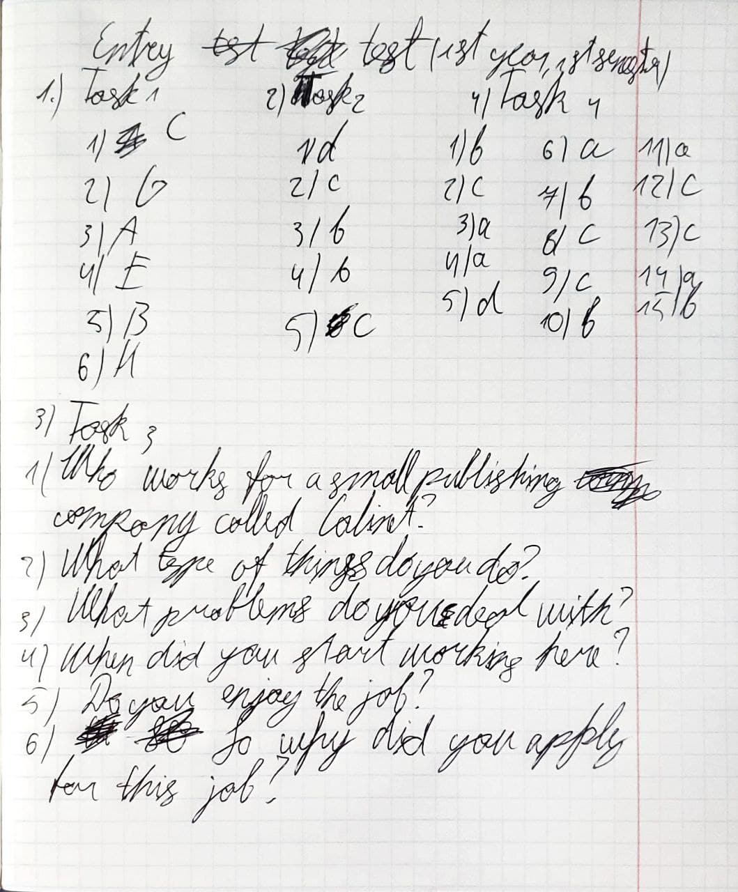

# Entry test(1st year, 1st semester)
1.   Task 1
    1.     C
    2.     G
    3.     A
    4.     E
    5.     B
    6.     H
2. Task 2
   1. d
   2. c
   3. b
   4. b
   5. c
3. Task 3
   1. Who works for a small publishing company called Calinet?
   2. What type of things do you do?
   3. What problems do you deal with?
   4. When did you start working here?
   5. Do you enjoy the job?
   6. So why did you apply for this job?
4. Task 4
   1. b
   2. c
   3. a
   4. a
   5. d
   6. a
   7. b
   8. c
   9. c
   10. b
   11. a
   12. c
   13. c
   14. a
   15. b

---

