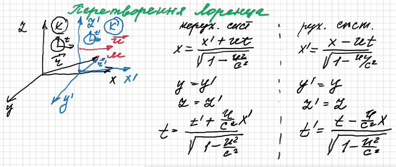
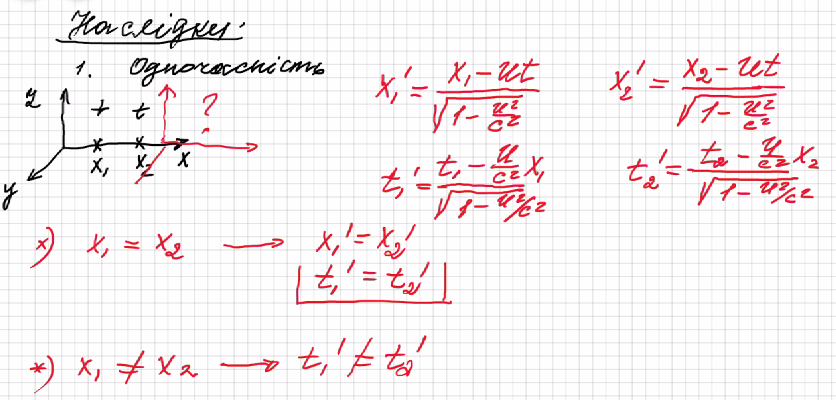
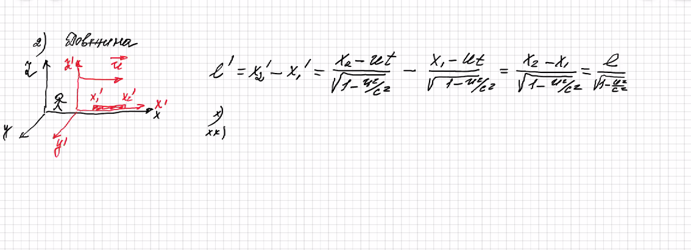
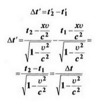
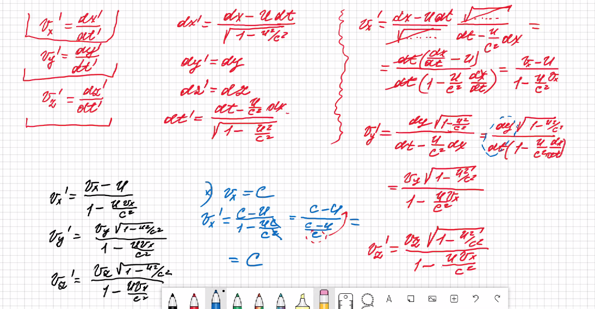
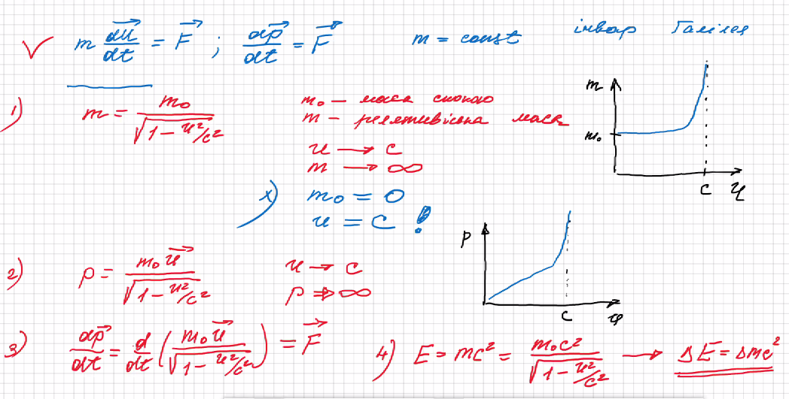
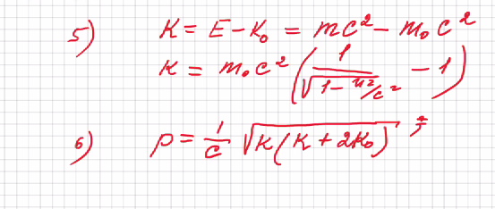

# СТВ
- Постулати
  - Всі закони інваріантні в усіх інерціальних законах відліку
  - Принкцип інваріантності світла 
    - Швидкість світла в вакуумі не залежить від швидкості джерела або швидкості спостерігача, однакова в усіх ситисемах відліку
  - Перетворення Лоренца
    - Час в двох системах протікає по різному
    - 
  - Наслідки перетворень Лоренца
    - Події які одночасні в одих системах відліку не є одночасними в інших системах відліку
      - 
    - Довжина тіл залежить від системи відліку
      - Найбільше довжину тіло має у системі яка знаходиться у стані спокою
      - Оскальки координати y та z однакові, то поперечні координати однакові
      - 
    - Тривалість подій
      - В різних системаї відліку тривалість подій різна
      - 
    - Швидкості
      - 
  - Релятивійська динаміка
    - Чим більша швидкість - тим більша масса
    - У фотона немає маси
    - 
    - 