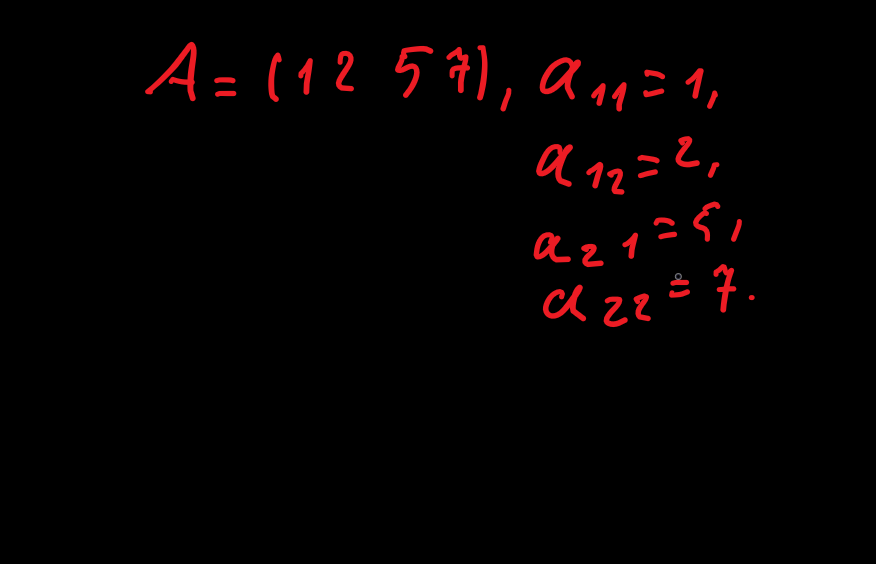
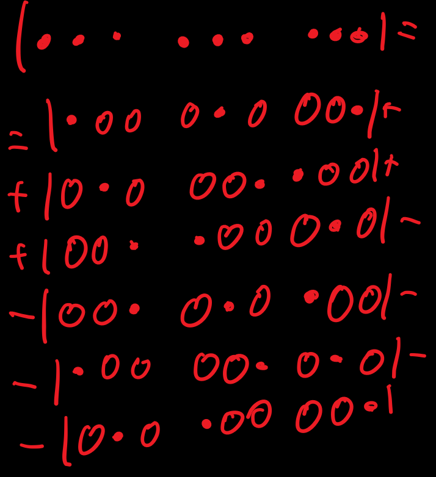
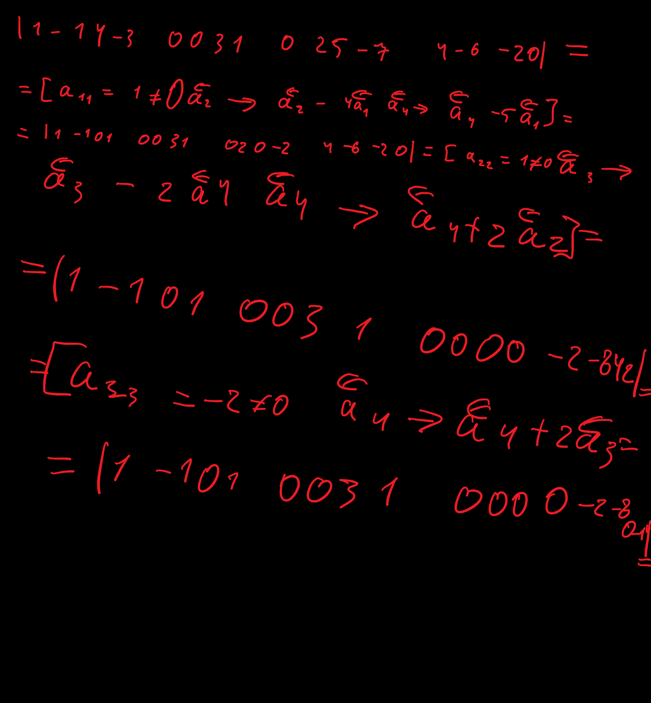

# Лекція 1. Визначники.
- Означення матриці.
  - > Матрицею А розміром m \* n називають прямокутну таблицю чисел a.ij розташованих у m рядках та n стовпцях, і позначають
  - A = (a.11 a.12 a.21 a.22 ...)
  - Числа a.ij називаються елементами матриці, перший індекс i означає номер рядка (i = 1, 2, ...m ), другий індекс j номер стовпця (j = 1, 2, ...n ) на перетині яких стоїть даний елемент. Елементами aij матрици можуть бути функції або алгебраїчні вирази. 
  - Матрицю позначають також так 
    - A = (a.ij)
    - A.m\*n = (a.ij).m\*n
  - i-й рядок (завдовжки n) матриці A.m*n позначають
    -  a.<-.i = (a.i1 a.i2 ... a,in )
  - j-й стовпець (заввишки m) матрици А позначають 
    - a.->.j = (a.1j : a.mj)
  - Матриця A має m рядків a.<-.1, a.<-.2, ... та n стовпців a.->.1, a.->.2, ... .
  - Приклад 
    - Розгляньмо матрицю A розміру 2\*2 та випишимо її елементи, рядки та стовпці.
      - 
    - Рядки
      - a.<-.1 = (1 2)
      - a.<-.2 = (5 7)
    - Стовпці
      - a.->.1 = (1 5)
      - a.->.2 = (2 7).
  - Якщо m!=n, то матрицю А називають прямокутною
  - Якщо m = n, тобто кількість рядків дорівнює кільності стовпців, то A - квадратна матриця n-го порядку:
    - A = (a.ij)n\*n = (a.11 a.12 a.21 a.22 ... a.1n, ... a.2n, ... a.nn ) 
  - Матриця A в прикладі 1 це квадратна матниця 2-но порядку. Для квадратних матриць вводиться поняття головної та побічної діагоналі. Елементи a.11, a.22, ..., a.nm розташовані на головній діагоналі, елементи a.1n, ..., a.n1 на побічній діаногалі.
- Визначники
  - Розглянемо дівільну квадратну матрицю n-го порядку A = (a.ij)n\*m.
    - > Визначником(детермінантом) квадратної матриці A називається певне число, що позначається символами
    - |a.11 a.12 a.21 a.22 ... a.1n ... a.2n ... ... a.n1 a.n2 ... ... ... a.nm| або delta.n, detA
  - та обчислюється за наведеними далі правилами.
    - Елементи a.ij матриці A називаються елементами визначника, а рядки та стовпці матриці A - рядками та стовпцями визначника.
      - Зауваження
        1. Визначник для неквадратної матриці  не означують.
        2. Будьте уважні щодо позначення матриці A та її визначника detA, наприклад
           - A = (1 2 5 7), дужки клуглі
           - detA = |1 2 5 7|, дужки прямі!!!
- Правила обчислення визначників матриць 1-го, 2-го та 3-го порядку.
  1.  Визначник 1-го порядку матриці A = (a.11)
      - detA = |a.11| = a.11.
        - Приклад A = (-5), detA = |-5| = -5
  2. Визначнак 2-го порядку матриці A = (a.11 a.12 a.21 a.22) обчислюється за формулою
     - > delta.2 = |a.11 a.12 a.21 a.22| = a.11 \* a.22 - a.21 \* a.12 
      - Для обчислення визначника 2-го порядку потрібно **від добутку елементів, що стоять на головній діагоналі, відняти добуток елементів, розміщених на побічній діагоналі.** Схематично це правило зображають так:
     - 
       - Приклад. Обчислити визначник. |2 -3 1 4| = 2\*4 - 1\*(-3) = 8 + 3 = 11
   3. Правило трикутників для обчислення визначника 3-го порядку. Схематично це правило забражають так
      - 
       - За правилом трикутників визначник 3-го порядку дорівнює сумі 6 доданків, перші три доданки зі знаком плюс є добутками елементів, що стоять на головній діаногалі і в вершиназ двох трикутників, у яких одна сторона паралельна головній діагоналі. Аналогічно утворюються доданки зі знаком мінус, де за основу береться побічна діаногаль.
         - Приклад 3. Обчислити визначник за привилом трикутників
           - delta.3 = |1 2 3  2 1 4  -1 4 5| = 1\*1\*5 + 2\*4\*(-1) + 3\*2\*4 - (-1)\*1\*3 - 2\*2\*5 - 1\*4\*4 = 5-8+24+3-20-16=32-44=-12
- Обчислення визначників методом розкладу за елементами рядка або стовпця.
  - Означення
    - > Мінором M.ij елемента a.ij визначника n-го порядку називаэться визначнак (n-1)- го понядку, отриманий з даного визначника викресленням і-го рядка та j-го стовпця, тобто рядка та стовпця на перетині яких стоїть елемент a.ij.
  - Зауваження
    - Мінор M.ij називають також доповнятьним мінором.
  - Означення.
    - > Алгебраїчним доповненням A.ij елемента a.ij визначника називається його мінор M.ij, взятий зі знаком (-1)^(i+j), тобто **A.ij = (-1)^(i+j) \* M.ij**
  - Приклад 4. Для визначника delta.3 з прикладу 3 обчислити мінор та алгебраїчне доповнення елементів a.11 zта a.12
    - Для обчислення мінорa M.11 викреслюємо з визначника delta.3 1-й порядок та 1-й стовпець, отримаємо визначник 2-го порядку, якому за означенням  дорівнює мінор M.11
      - M.11 = | 1 4 4 5 | = 1\*5 - 4\*4 = -11, A.11 = (-1)^(1+1) \* M.11 = M.11 = -11
    - Для обчислення мінора M.12 викреслюємо з delta.3 1-й та 2-й стовпець
      - M.12 = | 2 4 -1 5 | = 2\*5 - (-1)\*4 = 14, A.12 = (-1)^(1+2) \* M.12 = -M.12 = -14
  - Теорема про розклад визначника за елементами рядка(стовпця)
    - Визначник n-го порядку дорівнює сумі добутків елементів будь-якого рядка(стовпця) на їх алгебраїчні доповнення.
  - Застосуємо теорему до визначника 3-го порядку 
    - delta.3 = |a.11 a.12 a.13  a.21 a.22 a.23  a.31 a.32 a.33|
    - Напишемо деякі формули для обчислення delta.3
      - Розкладом за елементами 1-го рядка
        - delta.3 = a.11 \* A.11 + a.12 \* A.12 + a.13 \* A.13
      - Розкладом за елементами 2-го рядка
        - delta.3 = a.21 \* A.21 + a.22 \* A.22 + a.23 \* A.23
      - Розкладом за елементами 3-го стовпця
        - delta.3 = a.13 \* A.13 + a.23 \* A.23 + a.33 \* A.33
    - Зауваження
      - При обчисленні визначника розкладом за будь-яким рядком або стовпцем отримаємо одне й теж число 
    - Приклад 5. Обчислити визначник методои розкладу за елементами 1-го рядка.
      - delta.3 = |1 2 3  2 1 4  -1 4 5| = \[a.11 \* A.11 + a.12 \* A.12 + a.13 \* A.13\] = 1\*a.11 + 2\*A.12 + 3\*A.13
      - Обчислимо алгебраїчне доповнення A.13, оскільки A.11 = -11 та A.12 = -14 відомо з прикладу 4.
        - M.13 = |2 1  -1 4| = 2\*4 - (-1)\*1 = 9, A.13 = (-1)^(1+3) * M.13 = M.13 = 9
      - Отже delta.3 = A.11 + 2A.12 + 3A.13 = -11 -28 + 27 = -12
      - Отримали таку відповідь, як при обчисленні цтого пизначника за правилом трикуткиків в прикладі 3.
- Властивості визначників
  - Заміну рядків матриці її відповідними стовпцями, а стовпців - відповідними рядками, називають транспортуванням матриці
  - Означення
    - > Матрицю розміном n \* m, яку одержують з матриці Ф розміром m\*n транспонуванням стовпців(рядків), називають транспонованою матрицею до A і позначають A.T.
  - Приклади
    - A = (1 2 3), A.T. = (1 2 3)
    - A = (1 2 3  -5 4 1), A.T. = (1 -5  2 4  3 1)
  - Розглянемо(на прикладі визначників другого порядку) основні властивості визначників
    1. Рівноправність рядків та стовпців
         - Транспонування матриці не змінює її визначника
           - detA = detA.T, |a.11 a.12 a.21 a.22| = |a.11 a.21 a.12 a.22|
         - З властивості 1 випливає, що всі подальші властивості справедливі і для рядків і для стовпців
    2. Якщо переставити місцями два стовпці(рядки) визначника, то він змінить знак на протилежний
       - |a.11 a.12 a.21 a.22| = \[a.->.1 <-> a.<-.2\] = -|a.12 a.11 a.22 a.21|
    3. Спільний множник, що міститься в усіх елементах одного стовпця(рядка) пожна виносити за знак визначника
       - |a.11 ka.12 a.21 ka.22| = k|a,11 a,12 a,21 a,22|
       - |ka.11 ka.12 a.21 a.22| = k|a.11 a.12 a.21 a.22|
    4. Умови рівності нулю визначника.
       - Визначник допівнює нулю, якщо він містить
         - нульовий стовпець(рядок) 
         - два однакові стовпці(рядки)
         - пропорційні стовпці(рядки)
           - |a.11 a.12 0 0| = |a.11 a.12 a.11 a.12| = |a.11 a.12 ka.11 ka.12| = 0
    5. Лійність
       - Якщо стовпець(рядок) визначника є сумою двох стовпців(рядків), то визначник дорівнює сумі двох відповідних визначників
         - |a.11 a.12 + b.12 a.21 a.22 + b.22| = |a.11 a.12 a.21 a.22| + |a.11 b.12 a.21 b.22|
    6. Визначник не зміниться, якщо до улументів деякого рядка(стовпця) додати відповідні елементи іншого рядка(стовпця), помножені на одне й те саме число
       - |a.11 a.12 a.21 a.22| = \[a.<-.2 -> a.<-.2 + ka.<-.1\] = |a.11 a.12 a.21 + ka.11 a.22 + ka.12|
       - Доведення
         - |a.11 a.12 a.21 + ka.11 a.22 + ka.12| = за властивістю 5 = |a.11 a.12 a.21 a.22| + |a.11 a.12 ka.11 la.12| = за властивістю 4 = |a.11 a.12 a.21 a.22| + 0 = |a.11 a.12 a.21 a.22|
    7. Теорема анулювання
        - Сума добутків елементів стовпця(рядка) визначника на алгебричні доповнення відповідних елементів іншого стовпця(рядка) дорівнює нулю.
- Обчислення визначника методом Гауса(зведенням до трикутного вигряду)
  - Означення
    - > Визначник n-го порядку, всы елементи якого розташованы нижче выд говодної діагоналі дорівнюють нулю, називають визначником трикутного вигряду.
      - delta.3 = |a.11 a.12 a.13  0 a.22 a.23  0 0 a.33| - визначник 3-го порядку трикутного вигляду
  - Теорема.
    - Визначник трикутного вигряду дорівнює добутку елементів, розташованих на головній діагоналію
      - delta.n = a.11 \* a.22 \* a.33 ... \* a.nn
  - Доведення для визначника 3-го порядку
    - delta.3 = |a.11 a.12 a.13  0 a.22 a.23  0 0 a.33| = обчислимо розкладом за елементами 1-го стовпа = a.11 \* (-1)^(1+1)\*M.11 = a.11 \* |a.22 a.23 0 a.33| = a.11 \* a.22 \* a.33
  - Метод Гауса зведення визначника до трикутного вигляду полягає в перетворенні визначника до вигляду, коли всі елементи, розташовані нижче від головнох діагоналі, дорівнюють нулю, але всі діагональні елементи a.ii != 0. Для цього застосовують властивості 2, 3 та 6 визначника.
  - Нехай delta.n = detA визначник матриці A = (a.ij) n-го порядку
  - **Метод Гауса**
    - Крок 1. Ведучий рядок перший a.<-1 = (a,11 ... a.1n), ведучий елемент a.11
      1. Якщо a.11 = 0, то треба переставити 1-й стовпець з будь яким стовпцем, розташованим правіше ніж 1-й, або переставити 1-й рядок з будь яким рядком, розташованим нижче ніж 1-й. При цьому визначник змінить знак на протилежний.
           - Нехай a.11 != 0. Робимо за допомогою перщого рядка рівними нулю всі елементи 1-го стовпця, розташовані нижче діагонального a.11
      2. Від елементів 2-го рядка віднімаємо відповідні елементи 1-го рядка, помножені на число a.21/a.11 . Позначаємо це так
         - a.<-.2 --> a.<-2 - a.21/a.11 \* a.<-.1
      3. Від елементів 3-го рядка віднімаємо віповідні елементи 1-го рядка, помножені на число a.31/a.11 . Позначаємо це так
         - a.<-.3 --> a.<-.3 - a.31/a.11 \* a.<-.1
      4. Від елементів 4-го рядка віднімаємо відповідні елементи 1-го рядка, ромножені на число a.41/a.11 . Позначаємо це так
         - a.<-.4 --> a.<-.4 - a.14/a.11 \* a.1 
      5. Продовжуємо так далі до останнтого n-го рядкаю
 - Крок 2. Ведучий рядок другий a.<-2 = (a,22 ... a.2n), ведучий елемент a.22
      1. Якщо a.22 = 0, то треба переставити 2-й стовпець з будь яким стовпцем, розташованим правіше ніж 2-й, або переставити 2-й рядок з будь яким рядком, розташованим нижче ніж 2-й. При цьому визначник змінить знак на протилежний.
           - Нехай a.22 != 0. Робимо за допомогою 2-го рядка рівними нулю всі елементи 2-го стовпця, розташовані нижче діагонального a.22
      2. Від елементів 3-го рядка віднімаємо відповідні елементи 2-го рядка, помножені на число a.32/a.22 . Позначаємо це так
         - a.<-.3 --> a.<-3 - a.32/a.22 \* a.<-.2
      3. Від елементів 4-го рядка віднімаємо віповідні елементи 2-го рядка, помножені на число a.31/a.11 . Позначаємо це так
         - a.<-.4 --> a.<-.4 - a.42/a.22 \* a.<-.2
      4. Продовжуємо так далі до останнтого n-го рядкаю
  - Крок 3. Ведучий рядок третій a.<-.3, ведучий елемент a.33 .
    - виконується анаголічно
  - Крок (n-1). Ведучий рядок (n-1) - й a.<-.n-1, ведучий елемент a.n-1n-1
    - Виконується аналогічно. Це останній Крок.
  - Приклад 6. Обчислити визначник зведенням до трикутного вигляду 
    - 
    - визначник трикутного винляду дорівнює добутку елементів, розташованих на головній діагоналі = 1 \* 1 \* -2 \* -14 = 28