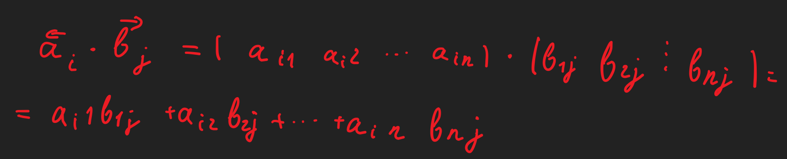
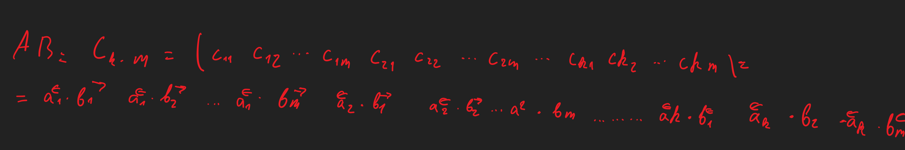

# Лекція 2. Дії над матрицями
- Лінійні дії над матрицями
  - Поняття рівності, суми різниці матриць вводиться тільки для матриць однакового розміру
  - Розглянемо матриці A = (a.ij).m\*n та B = (b.ij).m\*n розміром m\*n
    1. Матриці A та B називають рівними, якщо вони однакового розміру і мають рівні рівні відповідні елементи, тобто
       - A = B <--> a.ij = b.ij
    2. Сумою матриць A та B розмаром m\*n називають матрицю A + B розміром m\*n, кожен елемент якої дорівнює сумі відповідних елементів матриць доданків, тобто
       - A + B = (a.ij + b.ij).m\*n
    3. Різницею матришь A та B називають матрицю A - B, кожен елемент якої дорівнює різниці відповідних елементів матриць доданків, тобто
       - A - B = (a.ij - b.ij).m\*nф
    4. Добутком матриці F розміром m\* n на дійсне число lamda називають матрицю lamdaA розміром m\*n, кожен елемент якох дорівнює добуткові відповідного елемента матриці А на число lamda, тобто 
       - lamdaA = (lamdaa.ij).m\*n
  - Основні властивості
    - A + B = B + A
    - A + (B + C) = (A + B) + C
  - Приклад 1
    - Для матриць A = (1 2  -3 4 ), B = (5 6  2 -1), C = (6 3) знайти матриці A+B, 2A, A+C
    - Матриці A та B мають однакові розміри 2\*2. Отже, їх можна додавати
      - A + B = (1 2  -3 4) + (5 6  2 -1) = (1+5 2+6  -3+2 4+(-1)) = (6 8  -1 3)
    - 2A = 2(1 2  -3 4) = (2 4  -6 8)
    - A + C = (1 2  -3 4) + (6 3) не визначено , бо матриці A та C різного розміру
- Множення матриць
  - Операція множення двох матриць вводиться лише лдя узгоджених матриль
  - Матрицю А називають Узгодженою з матрицею В, якщо кількість стовпців першої матриці А дорівнює кількості рядків другої матриці В("довжина" матриці А дорівнює "висоті" матриці В). Для узгоджених матриць кількість елементів в рядку матриці А дорівнює кількості елементів в стовпці матриці B.
  - Приклади узгоджених матриць
    - A = (1 2  4 5), B = (6  1)
    - A = (1 2  4 5), B = (6 4  1 0)
    - A = (1 2  4 5), B = (6 4  3 1  0 2)
  - Нехай A.k\*n = (a.ij) та B.n\*m = (b.ij) узгоджені матриці, матриця А має n стовпців, матриця B має n рядків, тобто кількість елементів в рядку a.<-.i матриці А дорівнює кількості елементів в стовпці b.->.j матриці В та дорівнює n. ДОбутком і-го рядка матриці А на j-й стовпець матриці В називають число, яке позначається a.<-.i \* b.->.j, та дорівнює сумі добутків елементів рядка a.<-.i на відповідні елементи стовпця b.->.j 
    - 
  - Означення
    - > Добутком матриці A.k\*n = (a.ij) на узгоджену з нею матрицю B.n\*m = (b.ij) називається матриця AB = C.k\*m = (c.ij), кожний елемент c.ij якох дорівнює добуткові і-го рядка матриці А на j-й стовпець матриці В.
      - 
    - Це означення називають правилом множення рядка на стовпець
  - 
  - Для обчислення добутку потрібно виконати такі дії
    - Крок 1. Множимо 1-й рядок матриці А на 1-й, 2-й, ..., m-й стовпець матриці B. Отримаємо 1-й рядок (c.11 c.12 ... c.1m) матриці AB.
    - Крок 2. Множимо 2-1 рядок матриці А на 1-й, 2-й, ... m-й стовпець матриці B. Отримаємо 2-1 рядок (c.21 c.22 ... c.2m) матриці AB.
    - Далі множимо 3-й, 4-й, ... К-й рядок матриці А на стовпі матриці B. Отримаємо 3-й, 4-й, ..., к-й рядок матриці AB.
    - Обчислена таким чином матриця АВ має k рядків та m стовпів
  - Приклад 2.
    - Задано матриці
      - A = (1 2  -1 0  3 4), B = (5 6  -3 -2  2 1)
    - знайти добуток
      -   a.<-.1 \* b.->.1
      -   AB
      -   BA
          -   Щоб помножити рядок на узгоджений з ним стовпець, треба перемножити їхні відповідні елементи і добутки додати 
              -   a.<-.1 \* b.->.1 = (1 2) \* (5 -2) = 1 \* 5 + 2 \* (-2) = 5-4 = 1
          - Матриці А та В узгоджені, юо кількість елементів в рядку матриці А довівнє кількості елементів в стовпці В Щоб обчислити АВ
            - Крок 1 Множимо 1-й рядок матриці А на 1-й, 2-й, 3-й стовпець матриці В, отримаємо 1-й рядок (c.11 c.12 c.13) матриці АВ.
            - Крок 2. Множимо 2-й рядок матриці А на 1-й, 2-й, 3-й стовпець матриці В, отримаємо 2-й рядок (c.31 c.32 c.33) матриці АВ.
              - AB = (1 2  -1 0  3 4)(5 6  -3 -2  2 1) = (1 \* 5 + 2 \* (-2) 1 \* 6 + 2 \* 2 1 \* (-3) + 2 \* 1 (-1) \* 5 + 0 \* (-2) (-1) \* 6 + 0 \* 2 (-1) - 3 + 0 \* 1 3 \* 5 + 4 \* 2 3 \* (-3) + 4 \* 1) = (1 10 -1 -5 -6 3 7 26 -5) 
          - Матриці В та А узгоджені, бо кількість елементів в рядку матриці В дорівнює кількості елементів в стовпці матриці А.
            - BA = (5 6 -3  -2 2 1)(1 2  -1 0  3 4) = (5 \* 1 + 6 \* (-1) + (-3) \* 3 5 \* 2 + 6 \* 0 + (-3) \* 4 (-2) \* 1 + 2 \* (-1) + 1 \* 3 (-2) \* 2 + 2 \* 0 + 1\* 4 ) = (5-6-9 10+0-12 -2-2+3 -4+0+4) = (-10 -2 -10).
  - Зауваження. Для матриць А та В з прикладу АВ != ВА, це загальна властивість добутку матриць Якщо АВ = ВА, то матриці А та В називають переставними або комутуючими
- Властивості множення матриць
  - АВ != ВА
  - A(BC) = (AB)C
  - (lamdaA)B = A(lamdaB) = lamda(AB), де lamda є R, стала
  - C(A + B) = CA + CB
  - (AB)^(T) = A^(T)B^(T)
  - A.k\*n \* E.n = E.k \* A.k*n , A.n\*n \* E.n = E.n \* A.n\*n = A.n\*n
    - Де E.n - одинична матриця n-го порядку, тобто квадратна матриця n-го порядку, всі діагональні елементи якої дорівнюють одиниці, а всі інші елементи одрівнююьь нулю
      - E.2 = (1 0  0 1), E.3 = (1 0 0  0 1 0  0 0 1)
    - Одинична матриця E.n n-го порядку переставлена з будь ягою квадратною матрицею А того ж порядку АЕ.n = E.n \* A.
- Піднесення до степеню. Матричні многочлени.
  - Означення
    - > Квадратна матриця А називається невиродженую, якщо detA != 0, та виродженою, якщо detA = 0.
    - > Обернена матриця існує тільни у невиродженої матриці
  - Означення
    - > Квадратна матриця A^(-1) n-го порядку називається оберненою матрицею до квадратної невиродженої матриці А n-го порядку, якщо виконується умова
      - AA^(-1) = A^(-1)A = E
        - Де Е - одинична матриця такого ж порядку, як матриця А
- Знаходження оберненої матриці методом приєднаної матриці
  - Розглянемо на прикладі матриці А 3-го порядку
    - $A = (a_{ij}) = (a_{11}\,a_{12}\,a_{13}\,a_{21}\,a_{22}\,a_{23}\,a_{13}\,a_{23}\,a_{33})$
  - Крок1. Обчислимо визначник матриці А/ Якщо detA = 0, то $A^{-1}$ не існуєю 
  - Нехай detA $\neq$ 0, Невироджена, $A^{-1}$ існує
  - Крок 2. Знаходимо алгебраїчні доповнення $A_{ij}$ всіх елементів $a_{ij}$ визначника матриці А
    - $A_{ij} = (-1)^{i+j} M_{ij}$
  - Складаємо матрицю алгебраїчних доповнень $(A_{ij})$
    - $(A_{ij}) = (A_{11}\,A_{12}\,A_{13}\,A_{21}\,A_{22}\,A_{23}\,A_{31}\,A_{32}\,A_{33})$
  - Крок 3 Транспонуємо матрицю алгебраїчних доповнень. Отримана матриця $(A_{ij})^T$ називається приєднаною матрицею до матриці А
    - $(A{ij})^T = (A_{11}\,A_{12}\,A_{13}\,A_{21}\,A_{22}\,A_{23}\,A_{31}\,A_{32}\,A_{33})$
  - Крок4 Обернену до А матрицю знаходимо за формулою
    - $A^{-1} = \frac{1}{detA}(A_{ij})^T$
  - Крок 5 Перевіряємо правільність обчислень. Переконуємось, що $A^{-1}A = E$
  - Зауваження
    - Оскільки метод приєднаної матриці потребує обчислення великої кільності визначників, то його застосовують частіше для теоретичних міркувань й обернення матриць 2-го та 3-го порядків
    - Обернену матрицю до матриць 3-го та вищих порядків знаходять ще методом Гауса-Йордана 
      - Posibnyk LA-AG.pdf, стр. 32-33; та ВМ-1PraktykumLA-AG.pdf, стр. 84-85)
- Властивості оберненої матриці
  - $(A^{-1})^{-1} = A$
  - $(AB)^{-1} = B^{-1}A^{-1}$
  - $det(A^{-1}) = \frac{1}{detA}$
  - $(A^{-1})^T = (A^T)^{-1}$
- Матричні рівняння
  - Матричні рівняння, це рівняння такого вигляду
    - $AX = B$ або $XA = B$
    - де А,В - відомі матриці, Х - невідома
  - Якщо А квадратна невироджена матриця, тобто $detA\not ={0}$, то існує єдиний розв'язок цих рівнянь
    - $AX = B \Leftrightarrow X = A^{-1}B$
  - Доведення формули
    - Домножимо зліва та праву частини рівняння $AX = B$ на $A^{-1}$
    - $A^{-1}AX = A^{-1}B\Leftrightarrow A^{-1} B \Leftrightarrow X = A^{-1} B$
    - оскільки $A^{-1}A = E$ та $ EX = X$, Де Е - одинична матриця
- Приклад 3
  - Для матриці А знайти обернену матрицю $A^{-1}$ Результат перевірити
    - $A = (1\,1\,2\,\,2\,-1\,1\,\,4\,1\,4)$
  - Крок 1 
    - Обчислимо визначник матриці А
      - $detA = |1\,\,1\,2\,\,2\,-1\,2\,\,4\,1\,4| =[за\,правилом\,трикутників]=-4+8+4+8-8-2=6$
    - Отже detA = 6 $\not ={0}$ А невироджена матриця $A^{-1}$ існує
  - Крок 2
    - Знаходимо алгебраїчні доповнення $A_{ij}$ всіх елементів $a_{ij}$ визначника матриці A за формулою $A_{ij} = (-1)^{i+j}M_{ij}$ Мінори $M_{ij}$ дістаємо викреслюванням з визначника і-го рядка та j-го стовпця
      - $A_{11} = (-1)^{1+1}M_{11} = M_{11}=|-1\,2\,1\,4| = -4-2=-6.$
      - $A_12=(-1)^{1+2}M_{12}=-M_{12}=-|2\,2\,\,4\,4|=-(8\,-8)=0$
      - $A_{13}=(-1)^{1+3}M+{13}=M+{13}=|2\,-1\quad4\,1| = 2+4=6$
      - $A_{21} = (-1)^{2+1}M_{21}=-M_{21}=-|1\,2\quad1\,4|=-(4 -2) =-2$
      - $A_{-1}^{2+2}M_{22}=M_{22}=|1\,2\quad4\,4\,|=4-8=4$
      - $A_{23}=(-1)^{2+3}M_{23}=-M_{23}=-|1\,1\quad 4\,1|=-(-14)=3$
      - $A_{31}=(-1)^{3+1}M_{31}=M+{31}=|1\,2\quad -1\,2|=2+2=4$
      - $A_{32}=(-1)^{3+2}M_{32}=-M_{32}=-|1\,2\quad 2\,2| = -(2-4)=2$
      - $A_{33}=(-1)^{3+3}M_{33}=M_{33}=|1\,1\quad 2\,-1| = -1-2=-3$
    - Складаємо матрицю алгебраїчних доповнень $(A_{ij})$
      - $(A_{ij}) = (A_{11}\,A_{12}\,A_{13}\,A_{21}\,A_{22}\,A_{23}\,A_{31}\,A_{32}\,A_{33})$
  - Крок 3 Транспонуємо матрицю алгебраїчних доповнень
    - $(A_{ij})^T=(-6\,0\,6\quad -2\,-4\,3\quad 4\,2\,-3)^T = (-6\,-2\,4\quad 0\,-4\,2\quad 6\,3\,-3)$
    - Отримана матриця $(A_{ij})^T$ називається приєднаною матрицею до матриці А
  - Крок 4 Обернену до А матрицю знаходимо за формулою
    - $A^{-1} = \frac{1}{detA}(A_{ij})^T$
    - Оскільки detA = 6, то
      - $A^{-1} = \frac{1}{6}(A_{ij})^T = \frac{1}{6}(-6\,-2\,4\quad 0\,-4\,2\quad 6\,3\,-3) = (-1\,\frac{-1}{3}\,\frac{2}{3}\quad 0\,\frac{-2}{3}\,\frac{1}{3}\quad1\,\frac{1}{2}\,\frac{-1}{2})$
  - Крок 5 Перевіряємо, що $A^{-1}A=E$ Для спрощення обчислення $A^{-1}A$ краще застосувати таку властивість добутку матриць $(\alpha B)A=\alpha (BA)$, де $\alpha$ - стала
    - $A^{-1}A=\frac{1}{6}(-6\,-2\,4\quad 0\,-4\,2\quad 6\,3\,-3)(1\,1\,2\quad\,-1\,2\quad 4\,1\,4) = [множимо(A_{ij})^TA] = \frac{1}{6}(-6-4+16\,-6+2+4\,-12-4+16\quad 0-8+8\,0+4+2\,0-8+8\,6+6-12\,6-3-3\,12+6-12)=166=(1\,0\,0\,0\,1\,0\,0\,0\,1) = E$
  - Відповідь $A^{-1} = (-1\, \frac{-1}{3}\,\frac{2}{3}\quad 0\,\frac{-2}{3}\,\frac{1}{3}\quad1\,\frac{1}{2}\,\frac{-1}{2})$
